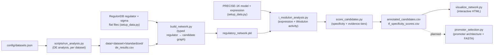

# Regulatory network analysis

This pipeline turns per-antibiotic differential-expression results into a
ranked list of candidate genes for biosensor promoters, by combining
RegulonDB regulatory evidence with iModulon/PRECISE-1K activity evidence. It
is a **heuristic screening aid**, not a source of ground truth: expression
and activity values are reported as *evidence*, and burden values are
*proxies*, not measured burden. See the root [`README.md`](../README.md)
for the overall project goal, and the team Notion for full scientific
background and how this fits into the biosensor design.

## Pipeline at a glance



Every stage is a separate script that reads and writes plain files, so you
can inspect intermediate output at any point, or re-run just one stage.
Nothing upstream of `network_analysis/output/` is ever mutated in place —
each run regenerates it from scratch.

## Quickstart

Run from the repository root. This is the default end-to-end sequence;
see the sections below for flags and alternatives at each stage.

```bash
# 1. Install dependencies
python -m pip install -r network_analysis/requirements.txt

# 2. Configure and fetch versioned reference data (RegulonDB + PRECISE-1K)
cp config/network_assets.example.json config/network_assets.json
# review provider/release/license/citation fields, then:
python network_analysis/setup_data.py --manifest config/network_assets.json --download

# 3. Build the typed regulatory graph
python network_analysis/build_network.py \
  --regulator data/network_regulator_gene.tsv \
  --sigma data/network_sigma_gene.tsv \
  --mapping data/network_gene_mapping.tsv

# 4. Annotate with iModulon/PRECISE-1K evidence
python network_analysis/i_modulon_analysis.py \
  --graph network_analysis/output/regulatory_network.pkl \
  --precise data/precise1k/model.json.gz \
  --expression data/precise1k/expression.csv \
  --mapping data/network_gene_mapping.tsv \
  --expression-units 'log2(TPM)' \
  --expression-normalization 'quality-controlled, uncentered PRECISE-1K expression'

# 5. Score and visualize
python network_analysis/score_candidates.py
python network_analysis/visualize_network.py
```

The one output you'll use most is
`network_analysis/output/annotated_candidates.csv` — see
[Reading the output](#reading-the-output) below before you use it for
anything downstream.

## Data contract and setup

Copy `config/network_assets.example.json` to `config/network_assets.json`
and review the provider, release, license, and citation metadata. The
manifest records where each asset comes from; `setup_data.py --download`
generates `config/network_assets.lock.json` with the exact retrieved
bytes, release metadata, upstream IDs, sizes, retrieval times, and SHA256
values. Hashes do not need to be captured manually before the first
download.

The setup validator requires:

- RegulonDB `>= 14.5.0` for regulator, sigma, and identity products. The
  default GraphQL provider queries `getDatabaseInfo`, `listAllFileNames`,
  and `getDataOfFile`; its endpoint is configurable because the documented
  host is currently a prerelease host.
- PRECISE-1K dataset release `>= 1.0`, with the model and companion
  expression file pinned to the same source revision. The iModulonDB
  Version 2.5.0 platform release is recorded as contextual catalog
  provenance, not confused with the PRECISE-1K dataset release.

`pymodulon==0.2.1` is the compatibility runtime used by the recovered
loader. The model supplies iModulon matrices and metadata; gene-level
expression is loaded from `IcaData.log_tpm`, then a documented `IcaData.X`,
then the companion expression file.

Download missing files and generate the lock, verify an existing checkout,
or explicitly accept changed upstream bytes:

```bash
python network_analysis/setup_data.py --manifest config/network_assets.json --download
python network_analysis/setup_data.py --manifest config/network_assets.json
python network_analysis/setup_data.py --manifest config/network_assets.json --download --refresh-lock
```

For an offline checkout, retain both the downloaded files and the lock.
The validator never silently accepts a changed cached file — if upstream
bytes change, you have to explicitly re-accept them with `--refresh-lock`,
which is a deliberate friction point so nobody re-scores candidates on
silently-drifted reference data without noticing.

The downloader verifies HTTPS certificates. In a managed environment with
a private certificate authority, point `SSL_CERT_FILE` at the
organization's CA bundle; do not disable certificate verification.

The identity mapping is not optional scientifically for b-number/probe
inputs: pass the same-release mapping TSV/CSV with `--mapping`. Without it
the loader retains the source identifier and adds
`identity_mapping_not_verified`; those nodes may not join RegulonDB
symbols.

## Build and candidate-direction policy

The builder reads every configured
`data/<dataset>/standardized/de_results.csv` and retains all rows as
provenance. Candidate seeding is selectable:

```bash
python network_analysis/build_network.py \
  --regulator data/network_regulator_gene.tsv \
  --sigma data/network_sigma_gene.tsv \
  --mapping data/network_gene_mapping.tsv \
  --candidate-direction upregulated

python network_analysis/build_network.py \
  --regulator data/network_regulator_gene.tsv \
  --sigma data/network_sigma_gene.tsv \
  --mapping data/network_gene_mapping.tsv \
  --candidate-direction either-direction
```

`upregulated` is the default and seeds a gene if it is significant and
upregulated in any dataset. `either-direction` seeds on significant
induction or repression. Both modes retain the opposite-direction
observations as evidence; significant opposing directions are marked
`conflicted` and never count as corroboration.

The graph stores objective dataset counts, support fractions, per-class
tiers, source row IDs, padj source, identity source, and caveats. Supported
class keys are `beta_lactam`, `aminoglycoside`, `fluoroquinolone`,
`polymyxin`, `cross`, and `tf`; a duplicate dataset name is rejected to
prevent double-counting. Regulatory edges use `activates`, `represses`, or
`dual`; iModulon co-membership edges use `co-imodulon` and are **never**
scored as regulators — this is enforced in code, not just convention (see
`REGULATORY_EDGE_TYPES` in `build_network.py`).

**A note on adding classes vs. adding datasets.** These are different
operations. Adding a *dataset* to an *existing* class (e.g. kanamycin to
`aminoglycoside`) is config-only — add an entry to `config/datasets.json`,
no code changes. Adding an entirely *new class* requires editing
`CLASS_REGISTRY` in `network_analysis/dataset_registry.py`, since class
keys, colors, and condition keywords are defined there and checked by
`load_dataset_config`. Only four classes are currently registered:
`beta_lactam`, `aminoglycoside`, `fluoroquinolone`, `polymyxin`.

## iModulon/PRECISE annotation

The annotation stage accepts embedded gene expression when available and
falls back to the companion expression matrix:

```bash
python network_analysis/i_modulon_analysis.py \
  --graph network_analysis/output/regulatory_network.pkl \
  --precise data/precise1k/model.json.gz \
  --expression data/precise1k/expression.csv \
  --mapping data/network_gene_mapping.tsv \
  --expression-units 'log2(TPM)' \
  --expression-normalization 'quality-controlled, uncentered PRECISE-1K expression'
```

`--expression` is optional when the serialized `IcaData` contains a usable
gene-level `log_tpm` or $X$ matrix. It remains required for the selected
PRECISE-1K model because that artifact does not contain gene-level
expression. `ica.A` is iModulon activity, not gene expression — the
pipeline keeps these as two separate evidence families rather than
conflating them:

- `gene_expression`: basal, induced, delta, per-background values/counts,
  units, normalization, availability, and within-class basal/induced
  percentiles, from the companion matrix;
- `imodulon_activity`: the same basal/induced/delta structure from `ica.A`.

It also retains all weighted iModulon memberships, identifies the primary
iModulon separately, and reports `metabolic_burden_proxy` and
`translation_burden_proxy`: the sum of absolute gene-membership weights
($M$ matrix) across a gene's iModulons, restricted to the `Metabolism` and
`Translation` PRECISE system categories respectively. **Lower is
preferable**, but these are heuristic screening indicators, not measured
metabolic load.

**PRECISE-1K coverage is not uniform across antibiotic classes.** The
selected model has matched ciprofloxacin/control samples but does not
provide matched polymyxin samples, so polymyxin `gene_expression` and
`imodulon_activity` fields remain unavailable rather than being inferred —
this is intentional, not a bug. Earlier team investigation also found no
matched aminoglycoside conditions in this PRECISE-1K release's
`abx_media` grouping; **if that's still accurate**, kanamycin, gentamicin,
and tobramycin candidates may show the same kind of unavailable
expression/activity evidence for the same structural reason, even though
the code does not yet print an explicit caveat for that case the way it
does for polymyxin. Worth re-confirming against the actual downloaded
model and, if confirmed, adding an explicit caveat entry so it's visible
in `caveats` rather than only inferable from an empty field.

## Score and visualize

```bash
python network_analysis/score_candidates.py
python network_analysis/visualize_network.py
```

The scorer filters predecessors by `node_type=regulator` and the three
regulatory edge types before computing class specificity. The visualizer
escapes all tooltip values and exposes evidence tiers, per-dataset
evidence, expression, activity, caveats, and burden proxies. Generated
files belong in the ignored `network_analysis/output/` directory and
should not be committed.

## Reading the output

`annotated_candidates.csv` is dense — most columns exist so nothing gets
silently hidden, but that means it rewards knowing what to look at first.

### Glossary

| Column | Meaning |
|---|---|
| `evidence_tier` | Overall confidence label for the gene across all datasets. See tiers below. Not a weighted score — a transparent, rule-based bucket. |
| `evidence_tier_by_class` | Same tier logic, computed separately per antibiotic class — a gene can be `corroborated` for one class and `limited` for another. |
| `direction_consistent` | `False` if the gene is significantly regulated in opposite directions in different datasets (this is what makes a tier `conflicted`). |
| `regulators` / `best_regulator` | RegulonDB regulators (TF or sigma factor) upstream of this gene; `best_regulator` is whichever has the highest specificity for this gene's relevant class(es). |
| `best_regulator_specificity` | Fraction of `best_regulator`'s total RegulonDB targets that fall in the relevant class — 1.0 means every target it regulates is in this class. |
| `has_cross_reactive_regulator` | `True` if `best_regulator` also regulates genes in *other* antibiotic classes. This is a warning about promoter orthogonality, not a positive signal — see [Known pitfalls](#known-pitfalls--limitations). |
| `regulatory_clarity` | `best_regulator_specificity`, discounted 40% (×0.6) if `has_cross_reactive_regulator` is true. This is the single number the `biosensor_flag` triage is based on. |
| `biosensor_flag` | Coarse triage from `regulatory_clarity`: `recommended` (≥0.75), `review` (≥0.5), `weak` (below 0.5), `?` (no regulator found in RegulonDB at all). **A starting filter, not a final answer** — see the worked example. |
| `metabolic_burden_proxy` / `translation_burden_proxy` | Heuristic host-burden indicators from iModulon membership weights (lower is preferable). Not a measurement. |
| `caveats` | Dataset-level caveats that apply to this gene's evidence (e.g. "resistant-mutant comparison, not acute exposure"). Defined once in `dataset_registry.DATASET_CAVEATS` so wording can't drift between datasets. |
| `evidence_quality_flags` | Structural flags: `direction_conflict`, `tobramycin_only`, `identity_mapping_not_verified`. Different from `caveats` — these are about data-processing quality, not experimental-design caveats. |
| `tobramycin_only` | `True` if tobramycin is the *only* qualifying dataset — tobramycin is the one aminoglycoside dataset without a matched-control comparator in the current panel, so single-dataset support from it alone is explicitly weak. |

**Evidence tiers**, in order of confidence:

1. `conflicted` — significant opposing directions are present across datasets.
2. `limited` — the only qualifying dataset is tobramycin.
3. `supported` — other qualifying evidence, not meeting the bar below.
4. `corroborated` — direction-consistent significant evidence covers every configured dataset in at least one class.

### Worked example (illustrative — not live output)

To make the columns above concrete, here's a made-up but representative
row for a gene like `cpxP` (one of the biosensor's actual reporter genes),
assuming it were observed as significantly upregulated in both configured
`beta_lactam` datasets:

```
gene:                        cpxP
group:                       beta_lactam
evidence_tier:                corroborated      # significant + consistent in every configured beta_lactam dataset
best_regulator:               cpxR
best_regulator_specificity:   0.82              # 82% of cpxR's RegulonDB targets are beta_lactam-class candidates
has_cross_reactive_regulator: False
regulatory_clarity:           0.82              # = 0.82 * 1.0 (no cross-reactivity discount)
biosensor_flag:                recommended       # regulatory_clarity >= 0.75
metabolic_burden_proxy:       0.14              # low — preferable
caveats:                      (ceftazidime b-number mapping caveat, if ceftazidime contributed evidence)
```

Reading this: strong, direction-consistent evidence, a fairly
class-specific regulator, and low burden — a reasonable candidate to carry
into promoter selection. Contrast with a gene where `regulatory_clarity`
is 0.82 *and* `has_cross_reactive_regulator` is `True`: the discounted
score would drop to 0.49 (`review`, not `recommended`) — same raw
specificity, worse practical usefulness, because that regulator also
drives genes in another antibiotic class, threatening the orthogonality
your fluorescent channels depend on. `biosensor_flag` alone would not
show you this distinction as clearly as looking at
`has_cross_reactive_regulator` directly.

## Known pitfalls & limitations

These aren't bugs — they're properties of the underlying biology and data
that are easy to misread if you only look at the top-line columns.

- **A significant, well-supported gene is not yet a promoter.** This
  pipeline scores *genes*, not promoter fragments. A high
  `regulatory_clarity` score tells you a gene's expression responds
  specifically to a class of antibiotic — it says nothing about where the
  TSS is, how far upstream the operator sits, or how many promoters the
  gene has. The team's own recA/LexA experience is the cautionary example:
  the functional LexA operator sits roughly 300 bp upstream of the TSS, far
  enough that naively cloning "the region right before the gene" would
  have missed it. This is exactly the gap the planned
  `promoter_selection.py` module (pulling real RegulonDB promoter/TSS
  coordinates) is meant to close — treat `annotated_candidates.csv` as a
  *shortlist of genes worth investigating*, not a list of ready-to-order
  promoter fragments.
- **Cross-reactivity is a warning, not a bonus.** `has_cross_reactive_regulator`
  and `is_cross_reactive` (in `tf_specificity_scores.csv`) flag regulators
  that also drive genes in other antibiotic classes. For a multi-channel
  biosensor that depends on distinguishing antibiotic classes by which
  reporter lights up, a shared regulator is an orthogonality risk between
  channels, which is why it's penalized in `regulatory_clarity` rather than
  ignored.
- **PRECISE-1K coverage gaps look like missing data, not like errors.**
  See the polymyxin/aminoglycoside note under
  [iModulon/PRECISE annotation](#imoduloprecise-annotation). An empty
  `imodulon_activity` field for a polymyxin (and possibly aminoglycoside)
  candidate reflects a structural gap in the reference dataset, not a
  failure of the pipeline for that gene.
- **Per-dataset caveats matter and are easy to skim past.** Amoxicillin
  compares resistant mutants, not acute exposure. Gentamicin is microarray,
  not RNA-seq. Tobramycin has no matched-control comparator in the current
  panel. Ceftazidime, kanamycin, ciprofloxacin, and polymixinE all require
  a same-release identity mapping because they arrive as b-number locus
  tags. All of these are carried into `caveats` per-candidate — read them
  before treating a candidate as strong evidence, especially for genes
  where one caveated dataset is doing most of the work.
- **A gene downstream of a candidate becomes usable in a host-strain-dependent way.**
  This is outside this pipeline's scope, but worth flagging here since it's
  the most likely next mistake after using this output: some
  stress-response genes (recA being the clearest example) are non-functional
  in common cloning strains. `DH5α` carries the `recA1` null allele and
  will not produce an SOS signal even with a textbook-correct recA
  promoter construct — `MG1655` or `BW25113` are the correct hosts for
  SOS-dependent reporters. This pipeline has no way to know or check your
  eventual host strain; that verification has to happen at the
  strain-construction stage.

## Testing

```bash
python -m pip install -r network_analysis/requirements.txt
python -m pytest
```

`tests/test_network_contract.py` exercises every stage above (dataset
config validation, direction-mode/tier logic, co-iModulon edge exclusion,
manifest/lock validation, RegulonDB mapping normalization, and a full
mocked GraphQL download) against small synthetic fixtures. **No network
access and none of the real multi-gigabyte RegulonDB/PRECISE-1K assets are
required to run the test suite** — it's a fast, offline way to confirm
your environment is set up correctly before doing a real
`setup_data.py --download`.

## Roadmap

A `promoter_selection.py` module is planned as the next stage, consuming
`annotated_candidates.csv` and RegulonDB promoter/TSS products to produce
actual clonable promoter fragments (see the [pipeline diagram](#pipeline-at-a-glance)
above). Once merged, this file will gain a matching section; until then,
treat gene-level candidates as a shortlist, not a final promoter list, per
[Known pitfalls](#known-pitfalls--limitations) above.
